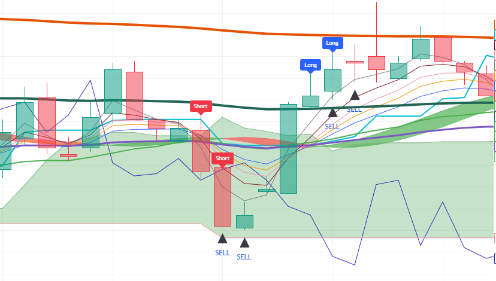

# Pine-Script-9min-Based-Indicator
Dual-timeframe indicator optimized for 3-minute and 9-minute trading based on EMA/SMA 20 crossovers and sequential RSI alignment with modular "Use" toggles. Signals entry for long/short in futures for any cryptocurrency on Trading View.

--

## Chart Preview

--

## Motivation & Problem

- **Market Noise & False signals**: Standard 1-minute and 3-minute scalp indicators often generate false signals due to micro-volatility, while higher-timeframe indicators (such as 15m or 1h) react too late for agile crypto futures trading.
- **The Core Goal**: To develop a multi-timeframe strategy that balances fast execution with trend stability by deploying dedicated signal engines for both 3-minute and 9-minute charts, enhanced with the "Use" toggle feature and sequential RSI momentum confirmation.

--

## Strategy Logic & Architecture

- This indicator avoids false signals and wrong interpretation of the trend by utilizing a **rule-based, multi-factor filtering system**:
 
### Core Components:
1. **Dual-Timeframe EMA & SMA 20 Filter**:
  - Calculates independent 10-period moving average ribbons for both the 3-minute (Min3TimeFrame) and 9-minute (Min9TimeFrame) charts.
  - Fast EMAs (lengths 3, 5, 7, 9) crossing above or below the 20-period SMA (SMA6 on 3m / SMA16 on 9m) act as the primary trend crossover triggers.
  - Dynamic horizontal lines track 1-hour and 1-day bar open prices directly on the chart as macro intraday support and resistance levels.

2. **Dedicated Timeframe RSIs & The "Use" Feature**:
  - Pulls separate 3-period RSI arrays (lengths 7, 9, 10) for both 3-minute and 9-minute horizons using 'request.security()'.
  - Enforces directional order: bullish momentum requires all RSIs to exceed 55 in sequential order (RSI 7 > RSI 9 > RSI 10), while bearish momentum requires all RSIs below 45 (RSI 7 < RSI 9 < RSI 10).
  - Integrates the "Use" toggle system (UseEMA1to10, UseRSI), giving traders complete control to activate or bypass specific indicator rules.

3. **Execution Rule**
  - **Bullish Signal**: Triggers on a 3-minute chart when fast EMAs cross above the 20 SMA (if enabled) and 3-minute RSIs are sorted above 55 (if enabled); or triggers on a 9-minute chart when 9-minute fast EMAs cross above the 20 SMA (if enabled) and 9-minute RSIs are sorted above 55 (if enabled).
  - **Bearish Signal**: Triggers on a 3-minute chart when fast EMAs cross below the 20 SMA (if enabled) and 3-minute RSIs are sorted below 45 (if enabled); or triggers on a 9-minute chart when 9-minute fast EMAs cross below the 20 SMA (if enabled) and 9-minute RSIs are sorted below 45 (if enabled).

--

## Configurable Parameters

Users can adjust the following parameters inside TradingView's settings panel:

- **Use Feature Toggles**: Default - EMA (true), RSI (true). Toggles individual indicator filters on or off dynamically.
- **Timeframe Settings**: Default - 1m, 2m, 3m, 9m. Configurable intervals for ribbon and momentum calculation.
- **EMA Length**: Default - 3, 5, 7, 9, 12, 20 (SMA), 30, 60, 100, 200. Lookback period for moving average ribbons.
- **RSI Length**: Default - 7, 9, 10. Lookback period for multi-length RSI.
- **Visual Overlays**: Optional display toggles for EMA ribbon, Ichimoku cloud, Hull Suite band, and 1H/1D time mark lines.

--

## How to Install & Use in TradingView

1. Open any crypto chart (e.g., `BTC/USDT`) on **[TradingView](https://www.tradingview.com/)**.
2. Open the **`Pine Editor`** console at the bottom of the page.
3. Open `indicator.pine` from this repository, copy the source code, and paste it into the editor.
4. Click **`Save`** and then click **`Add to Chart`**.
5. Click the gear icon (`Settings`) on the indicator to adjust parameters as needed.

--

## Key Learnings & Engineering Reflections

1. **Modular Filter Control Using the Ternary Operator (x ? y : true)**
  - I learned that using the ternary operator pattern (x ? y : true) (e.g., (UseEMA1to10 ? EMACrossUp3 : true)) allows individual filters to be toggled dynamically. If x is enabled, condition y must be satisfied; if x is false, it evaluates to true as a pass-through bypass, making the logic fully modular without needing nested if-else structures.
2. **Context-Aware Multi-Chart Execution (3m vs 9m)**
  - I learned that using 'timeframe.period' branching enables a single script to adapt its logic automatically depending on whether the user is viewing a 3-minute scalping chart or a 9-minute swing chart, applying the respective timeframe's ribbon and RSI calculations seamlessly.
